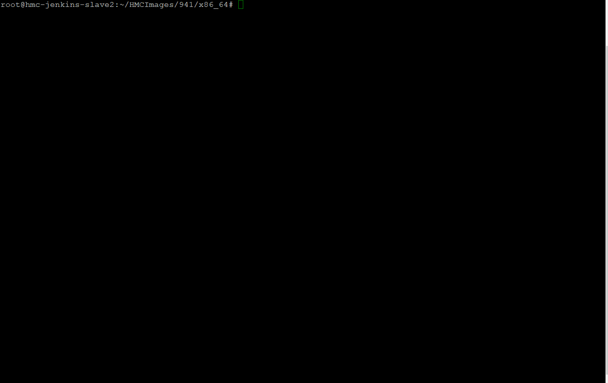
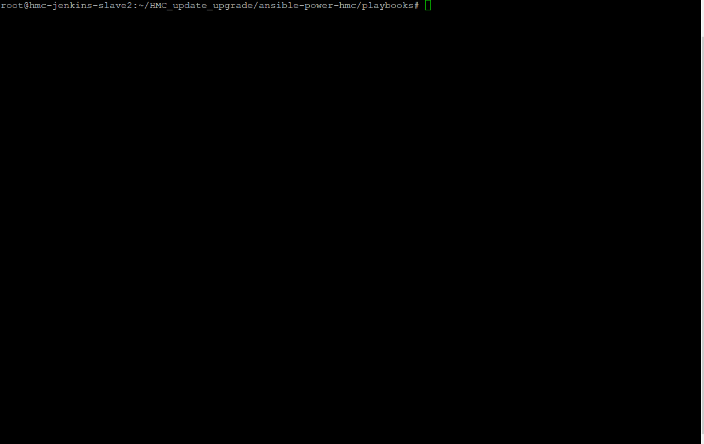

.. ...........................................................................
.. © Copyright IBM Corporation 2020                                          .
.. ...........................................................................

Demo
====

Following set of example scenarios demonstrate how to use the modules of the
**IBM Power Systems HMC collection** content

hmc_update_upgrade
------------------

Update
""""""
The following gif demonstrates the update of a HMC from V9 R1 M910 to V9 R1 M941
using disk source which takes the image from control node.

Upgrade
"""""""

The following gif demonstrates the upgrade of a HMC from V8 R870 to V9 R1 M910 
through NFS server.

hmc_pwdpolicy
-------------

Create and Activate
"""""""""""""""""""

The following gif demonstrates the creating of HMC password policy and
activating it.

.. figure:: ../images/demo_password_policy_create.gif
   :alt: 

Deactivate, Modify and Activate
"""""""""""""""""""""""""""""""

The following gif demonstrates the deactivating the active HMC password
policy then modify and activate it.

.. figure:: ../images/demo_password_policy_modify.gif
   :alt: 
